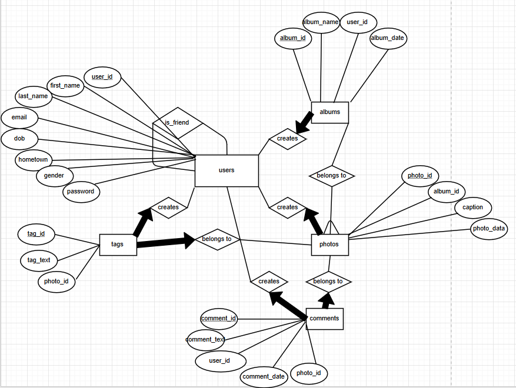

# 460PA1
photo sharing website

Made for bu cs460 in the django web framework.

To use, install django, download mysql and python connectors.

In MySQL, create database corresponding to what's found in settings.py, and allow permissions for the username and password found in settings.py

To run the website on localhost, enter the following in the terminal
$ python manage.py runserver

